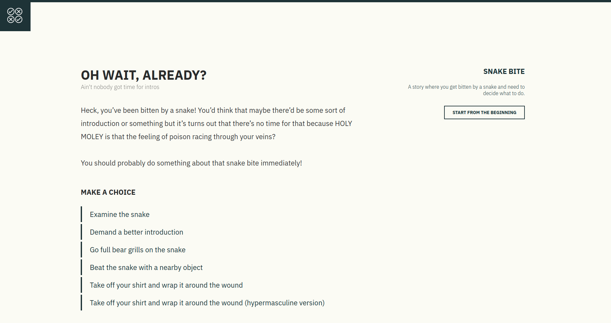
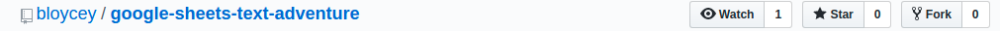
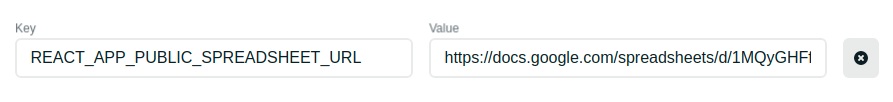

# Google Sheets Text Adventure

Here's an example of what you can build: [Snake Story](https://snakestory.netlify.com/).

This was made using [React](https://reactjs.org/), [React Router](https://reacttraining.com/react-router/web/guides/quick-start), and [Tabletop.js](https://github.com/jsoma/tabletop) however no knowledge of any of these tools are needed to get started with your own story hosted online for free. Just follow the steps and below you can create your own choose-your-own adventure story.

### How to create your own story.

#### 1. Create a github profile.

If you've already got a github profile then you can skip to step 2.

If you don't yet have a github profile you will to set one up. You can do this from the [homepage of github here](https://github.com/).

#### 2. Fork this repo.

You can fork this repo by clicking the button at the top of the page that looks like this:

Forking a repo creates a copy of the a project in your own github account. You'll need this for later!

#### 3. Create a google sheet

[Use this sheet as a template](https://docs.google.com/spreadsheets/d/1MQyGHFf_vjS-vN7Ra7LHmhYhKMnVgxaF9wmST4MsXeM/edit?usp=sharing)

You'll need to create your own sheet and copy and paste the fields accross. Note that there are 2 seperate sheets. Sheet1 is for the homepage. Sheet2 is for the story. It's important that the fields in row 1 stay the same on both sheets.

#### 4. Adjust the settings and grab the shareable link

- Go to the `File` menu and pick `Publish to the web`.
- Click `Start Publishing`. The default settings are fine.
- Click on the big green `Share` button in the top right hand corner of the page.
- Click on the very page `Advanced` button.
- Make sure access says `Anyone can *view*`.
- Click Save.
- Copy the `Link to Share` and paste it somewhere handy. You'll need this soon.

#### 5. Create a netlify account

Netlify is a service that allows free hosting for projects from github. Fortunately you just made a github account so this includes you!

Go to [netlify](https://www.netlify.com/), sign up and choose the `GitHub` option.

#### 6. Set up your site.

Once you're logged in select the teal `New site from Git` button.

On the next screen select the GitHub option.

This might prompt you to login with GitHub. Do so and select the `google-sheets-text-adventure` repo you forked earlier.

The next screen will show some build options for the site. Leave these as is. Click the `advanced` button and click the `new variable` button.

In the key section copy and paste the following: `REACT_APP_PUBLIC_SPREADSHEET_URL`.

In the value section paste the spreadsheet url that you saved earlier.

Now click `deploy`!

#### 7. Customise your URL

Netlify will now build your site for you. Once it's done it will generate a gibberish url for you to view your site on. Click it and take a look, everything should be working - but the story won't be very interesting.

Let's make that URL something more appealing.

Click on `Change site name` from your site's dashboard.

Here you can make the name more appealing. For the moment the URL will always be `SOMETHING.netlify.com` however if you'd like to buy a custom domain this is possible too. [Instructions for that are here](https://docs.netlify.com/domains-https/custom-domains/#definitions).

#### 8. Write your story!

All the hard bits are done now! All that's left is to write your story. As you update the google spreadsheet your site will automatically update. Woohoo!

A few tips on writing your story:

- Write your copy in a word processor like Google Docs or Microsoft word first, and then copy and paste it into the google sheet. Google sheets isn't good at formatting line breaks.
- If you want to link back to the homepage use "/" in the path field.
- Use a comma-seperated list for the choices and paths. Each choice should correlate to a path.
