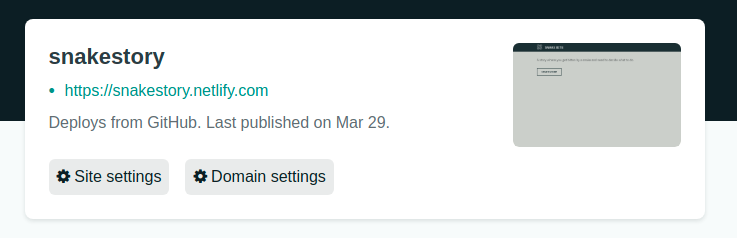

# Google Sheets Text Adventure

Here's an example of what you can build: [Snake Story](https://snakestory.netlify.com/) (However I'm sure your story will be much better!)

This was made using [React](https://reactjs.org/), [React Router](https://reacttraining.com/react-router/web/guides/quick-start), and [Tabletop.js](https://github.com/jsoma/tabletop) however no knowledge of any of these tools are needed to get started with your own story hosted online for free. Just follow the steps and below you can create your own choose-your-own adventure story.

## How to create your own story.

#### 1. Create a google sheet

First head to [google sheets](https://docs.google.com/spreadsheets/u/0/) and create a blank sheet.

In a new tab open up the [tempate sheet here](https://docs.google.com/spreadsheets/d/1MQyGHFf_vjS-vN7Ra7LHmhYhKMnVgxaF9wmST4MsXeM/edit?usp=sharing)

Copy and paste accross all the fields from the template into your own google spreadsheet. Note that there are 2 seperate sheets. Sheet1 is for the homepage. Sheet2 is for the story. It's important that the fields in row 1 stay the same on both sheets.

#### 2. Adjust the settings and grab the shareable link

- Go to the `File` menu and pick `Publish to the web`.
- Click `Start Publishing`. The default settings are fine.
- Back on the spreadsheet view click on the big green `Share` button in the top right hand corner of the page.
- Click on the very pale `Advanced` button.
- Make sure access says `Anyone with the link can *view*`.
- Copy the `Link to Share` and paste it somewhere handy. You'll need this soon.
- Click Save.

#### 3. Create a github account and netlify account.

If you've already got a github profile and netlify account then you can skip to step 4.

Github: Sign up for a [free github account here](https://github.com/).

Netlify: Go to [netlify](https://www.netlify.com/), sign up and choose the `GitHub` option.

#### 4. Click the button below and follow the prompts.

This may take a little while. Be patient!

If all goes succcessfully you should now have a site hosted on netlify with a strange gibberish URL. Excellent. At this stage the site will still be blank because we haven't yet linked the google spreadsheet to your site.

#### 5. Set up your site.

Click on the site settings button for your new site.

In the side panel click the "Build & Deploy" tab.

Scroll down to the section titled "Environment Variables.

Click the `new variable` button. In the key section copy and paste the following: `REACT_APP_PUBLIC_SPREADSHEET_URL`.

In the value section paste the spreadsheet url that you saved earlier.

Save!

#### 7. Customise your URL

While we're fiddling with the settings let's update the URL from that gibberish to something recognisable.

Head to the domain management tab in settings. In the custom domains section click the options dropdown and edit the site name.

#### 8. Write your story!

All the hard bits are done now! If you refresh your site you should now see All that's left is to write your story. As you update the google spreadsheet your site will automatically update. Woohoo!

A few tips on writing your story:

- Write your copy in a word processor like Google Docs or Microsoft word first, and then copy and paste it into the google sheet. Google sheets isn't good at formatting line breaks.
- If you want to link back to the homepage use "/" in the path field.
- Use a comma-seperated list for the choices and paths. Each choice should correlate to a path.
- If you have trouble with text overlapping in the spreadsheet select all the cells, head to the Format/Text Wrapping, and select 'clip'.
